# PhonyShop Database Schema

## Entity Relationship Diagram

```mermaid
erDiagram
    User ||--o| Profile : has
    User ||--o| Wallet : has
    User ||--o| UserMembership : has
    User ||--o{ Address : has
    User ||--o{ Order : places
    User ||--o{ Cart : owns
    User ||--o{ Wishlist : saves
    User ||--o{ Review : writes
    User ||--o{ SupportTicket : opens
    User ||--o{ Notification : receives
    User ||--o{ WalletTransaction : has
    User ||--o{ LoyaltyTransaction : earns
    User ||--o{ LoginHistory : logs
    User ||--o{ UserSession : maintains
    User ||--o{ UserAchievement : earns
    User ||--o{ UserCoupon : assigned
    User ||--o{ PriceAlert : sets
    User ||--o{ RecentlyViewed : views
    User ||--o{ ProductComparison : compares
    User ||--o{ BlogPost : authors
    User ||--o{ BlogComment : writes
    User ||--o{ ProductQuestion : asks
    User ||--o{ SearchHistory : searches

    MembershipLevel ||--o{ UserMembership : defines
    Achievement ||--o{ UserAchievement : awards

    Brand ||--o{ Product : manufactures
    Category ||--o{ Product : categorizes
    Category ||--o{ Category : parent_child

    Product ||--o{ ProductVariant : has
    Product ||--o{ ProductImage : has
    Product ||--o{ ProductVideo : has
    Product ||--o{ ProductSpecification : has
    Product ||--o{ ProductView : tracked
    Product ||--o{ PriceHistory : tracks
    Product ||--o{ Review : receives
    Product ||--o{ ProductQuestion : receives
    Product ||--o{ Accessory : links
    Product }o--o{ ProductComparison : compared

    Color ||--o{ ProductVariant : colors
    StorageOption ||--o{ ProductVariant : stores
    RAMOption ||--o{ ProductVariant : rams

    ProductVariant ||--o{ CartItem : in_cart
    ProductVariant ||--o{ OrderItem : ordered
    ProductVariant ||--o{ InventoryItem : stocked
    ProductVariant ||--o{ StockMovement : moved
    ProductVariant ||--o{ FlashSaleProduct : on_sale

    Cart ||--o{ CartItem : contains
    Cart }o--o| Coupon : applies
    Cart }o--o| GiftCard : uses

    Province ||--o{ City : contains
    Province ||--o{ Address : located
    City ||--o{ Address : located

    Order ||--o{ OrderItem : contains
    Order ||--o{ OrderStatusHistory : tracks
    Order ||--o| Invoice : generates
    Order ||--o{ Payment : pays
    Order }o--o| Coupon : uses
    Order }o--o| GiftCard : uses
    Order }o--o| ShippingMethod : ships_via

    Payment ||--o{ PaymentLog : logs

    Coupon }o--o{ Category : applies_to
    Coupon }o--o{ Product : applies_to

    FlashSale ||--o{ FlashSaleProduct : includes

    Warehouse ||--o{ InventoryItem : stores
    Supplier ||--o{ InventoryItem : supplies

    SupportTicket ||--o{ TicketReply : has
    TicketDepartment ||--o{ SupportTicket : handles
    TicketReply ||--o{ TicketAttachment : has

    Review ||--o{ ReviewImage : has
    Review ||--o{ ReviewHelpful : votes
    ProductQuestion ||--o{ ProductAnswer : answered

    BlogCategory ||--o{ BlogPost : contains
    BlogPost ||--o{ BlogComment : has

    Menu ||--o{ MenuItem : contains
    LandingPage ||--o{ LandingSection : has

    User {
        uuid id PK
        string email UK
        string phone UK
        string username
        image avatar
        bool is_email_verified
        bool is_phone_verified
        string preferred_language
        string preferred_theme
        bool two_factor_enabled
        string referral_code UK
        uuid referred_by FK
    }

    Product {
        uuid id PK
        string name
        string slug UK
        string sku UK
        string barcode
        uuid brand_id FK
        uuid category_id FK
        decimal base_price
        decimal compare_price
        bool is_active
        bool is_featured
        int view_count
        int sold_count
        decimal average_rating
    }

    ProductVariant {
        uuid id PK
        uuid product_id FK
        string sku UK
        uuid color_id FK
        uuid storage_id FK
        uuid ram_id FK
        decimal price
        int stock_quantity
        int reserved_quantity
        bool is_active
    }

    Order {
        uuid id PK
        string order_number UK
        uuid user_id FK
        string status
        decimal subtotal
        decimal discount_amount
        decimal tax_amount
        decimal total
        string tracking_number
    }

    Wallet {
        uuid id PK
        uuid user_id FK
        decimal balance
        decimal bonus_balance
        bool is_active
    }

    UserMembership {
        uuid id PK
        uuid user_id FK
        uuid level_id FK
        int points
        decimal total_spent
    }
```

## Database Statistics

| Domain | Tables | Description |
|--------|--------|-------------|
| Accounts | 12 | Users, profiles, wallet, membership, loyalty |
| Catalog | 16 | Products, variants, brands, categories, attributes |
| Cart | 3 | Cart, items, saved for later |
| Orders | 6 | Orders, items, invoices, shipping, locations |
| Payments | 2 | Payments and logs |
| Promotions | 6 | Coupons, gift cards, flash sales |
| Reviews | 5 | Reviews, Q&A, helpful votes |
| Blog | 3 | Posts, categories, comments |
| CMS | 12 | Pages, menus, banners, landing pages |
| Support | 4 | Tickets, replies, attachments |
| Notifications | 2 | Notifications and templates |
| Inventory | 4 | Warehouses, suppliers, stock |
| Search | 2 | Search history, popular searches |
| Analytics | 2 | Daily stats, page views |

**Total: ~79 tables**

## Key Indexes

- `products`: slug, sku, is_active+is_featured, view_count, sold_count, rating
- `product_variants`: sku, product+color+storage+ram unique
- `orders`: order_number, status+created_at
- `users`: email, referral_code
- `coupons`: code
- `notifications`: user+is_read

## Normalization

The schema follows 3NF (Third Normal Form):
- No redundant data — prices snapshotted in order items
- Separate variant attributes (color, storage, RAM) as lookup tables
- MPTT for hierarchical categories
- JSON fields only for flexible content (advantages, landing sections)
