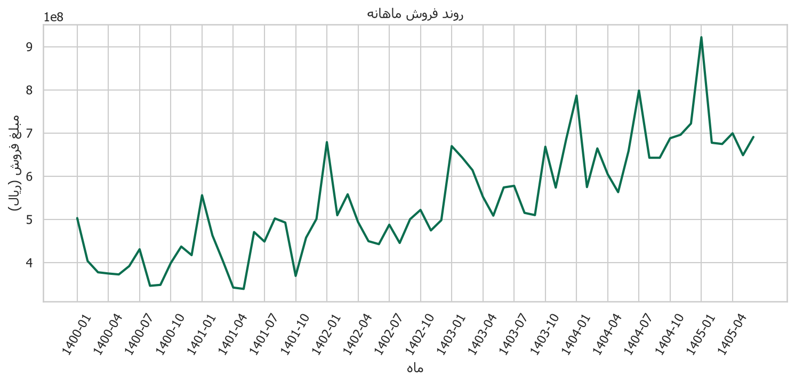
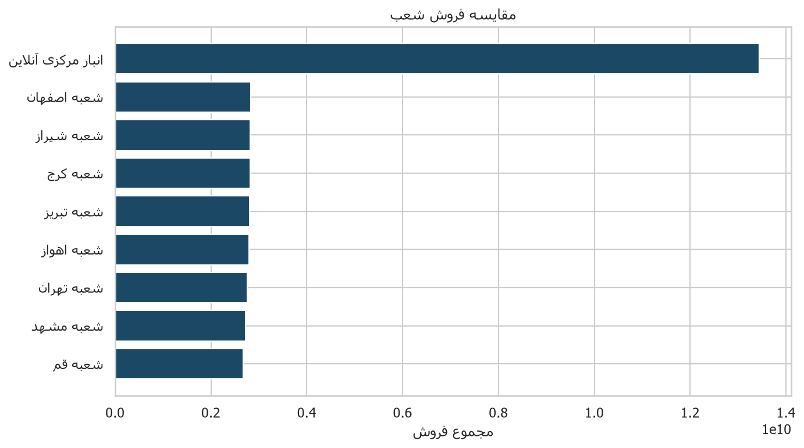
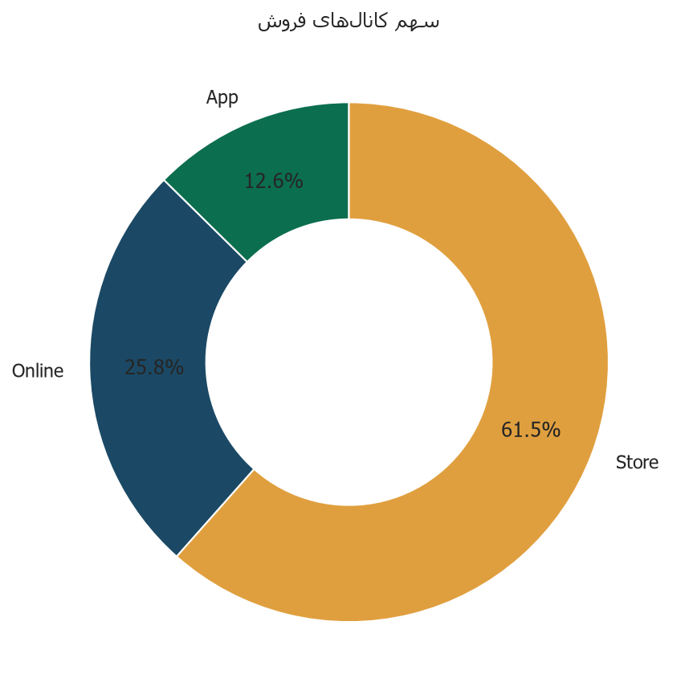
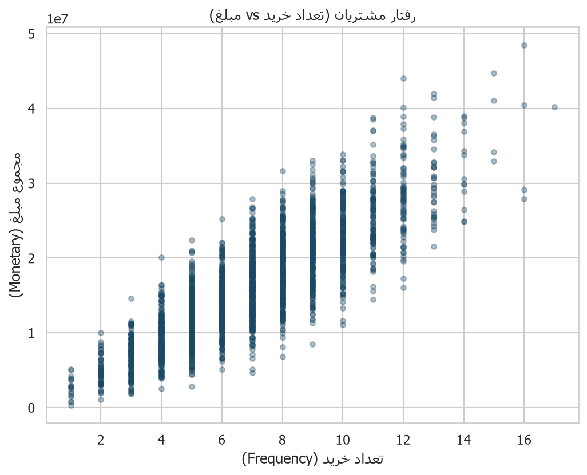
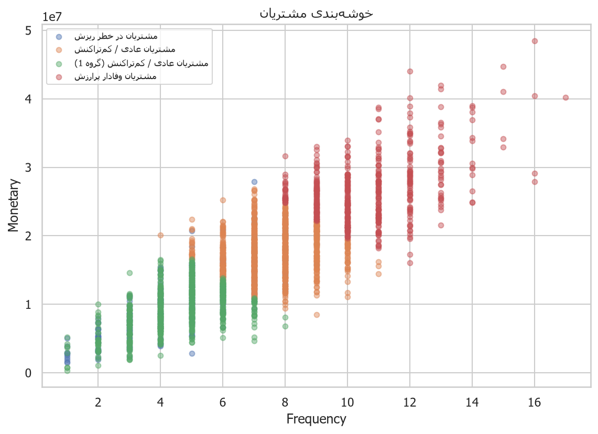
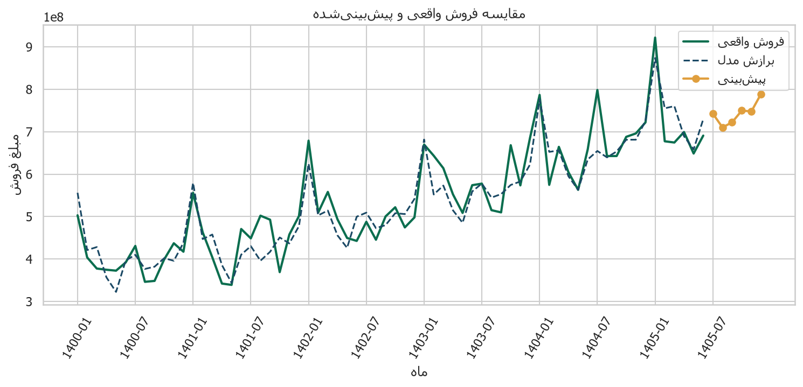
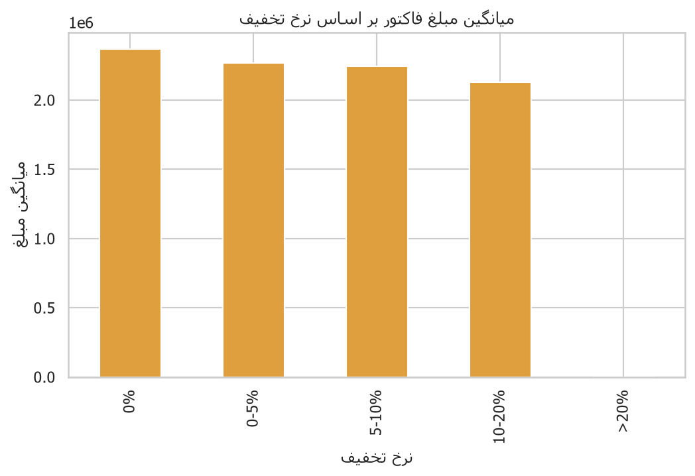

# گزارش جامع پروژه هوش تجاری
## تحلیل داده‌های فروش فروشگاه زنجیره‌ای

**استاد:** دکتر نشاطی  
**عنوان:** تحلیل داده‌های فروش یک فروشگاه زنجیره‌ای  
**بازه زمانی داده:** ابتدای سال ۱۴۰۰ تا اواسط سال ۱۴۰۵  

---

## فهرست مطالب
1. [مقدمه و هدف](#1-مقدمه-و-هدف)
2. [اطلاعات دیتاست](#2-اطلاعات-دیتاست)
3. [بخش اول: آماده‌سازی داده](#3-بخش-اول-آماده‌سازی-داده)
4. [بخش دوم: محاسبه KPIها](#4-بخش-دوم-محاسبه-kpiها)
5. [بخش سوم: مصورسازی](#5-بخش-سوم-مصورسازی)
6. [بخش چهارم: تحلیل داده‌ها](#6-بخش-چهارم-تحلیل-داده‌ها)
7. [بخش پنجم: پیش‌بینی فروش](#7-بخش-پنجم-پیش‌بینی-فروش)
8. [جمع‌بندی و پیشنهادات مدیریتی](#8-جمع‌بندی-و-پیشنهادات-مدیریتی)

---

## 1. مقدمه و هدف

این پروژه با هدف پاکسازی داده‌های فروش، استخراج شاخص‌های کلیدی عملکرد (KPI)، مصورسازی،
تحلیل رفتار مشتریان (شامل خوشه‌بندی) و پیش‌بینی روند فروش با پایتون انجام شده است.

مسیر اجرای کامل پروژه:

```bash
cd motaghi-bi-retail-project
python -m pip install -r requirements.txt
python src/run_all.py
```

خروجی‌ها در پوشه‌های `outputs/figures`، `outputs/tables`، `docs` و `reports` ذخیره می‌شوند.

---

## 2. اطلاعات دیتاست

پنج جدول اصلی:

| جدول | شرح |
|---|---|
| Product | اطلاعات محصولات |
| Branch | اطلاعات شعب |
| Customer | اطلاعات مشتریان |
| Invoice | اطلاعات فاکتورها |
| InvoiceItem | جزئیات اقلام فاکتور |

> **نکته:** در فایل تمرین، دیتاست جداگانه همراه PDF نبود؛ بنابراین دیتاست واقعی‌نما با همان ساختار
> و بازه زمانی (۱۴۰۰ تا میانه ۱۴۰۵)، همراه مقادیر Null و نویزی عمدی تولید و سپس پاکسازی شده است.
> کد تولید در `src/generate_data.py` و داده خام در `data/raw` قرار دارد.

---

## 3. بخش اول: آماده‌سازی داده

جزئیات کامل کیفیت داده و اقدامات در فایل `docs/01_data_cleaning.md` آمده است.

### خلاصه روش‌ها
- شناسایی Null، مقادیر خالی، تکراری‌ها، کلید خارجی نامعتبر، سن/قیمت/مقدار پرت و منفی
- پر کردن منطقی فیلدهای توصیفی (دسته، منطقه، جنسیت، شهر)
- حذف یا اصلاح رکوردهای نویزی عددی
- بازسازی مبلغ فاکتور از جمع اقلام برای یکپارچگی

### خروجی
جداول پاک‌شده در `data/cleaned/` ذخیره شده‌اند.

---

## 4. بخش دوم: محاسبه KPIها

### شاخص‌های فروش
| شاخص | مقدار |
|---|---|
| مجموع فروش | 35,660,850,124 |
| تعداد فاکتورها | 15,312 |
| میانگین مبلغ هر فاکتور | 2,328,948 |
| میانگین تعداد اقلام هر فاکتور | 3.49 |
| مجموع تخفیف | 699,828,879 |

### شاخص‌های زمانی (فروش سالانه و رشد)
| سال | فروش | نرخ رشد سالانه |
|---|---|---|
| 1400 | 4,803,964,908 | — |
| 1401 | 5,347,698,736 | 11.3% |
| 1402 | 6,061,840,866 | 13.4% |
| 1403 | 7,092,619,046 | 17.0% |
| 1404 | 8,041,901,946 | 13.4% |
| 1405 | 4,312,824,622 | -46.4% |


جداول ماهانه/سالانه/شعبه/مشتری در `outputs/tables/` ذخیره شده‌اند.

### شاخص‌های مشتری
| شاخص | مقدار |
|---|---|
| تعداد مشتریان فعال | 2,195 |
| میانگین خرید هر مشتری | 16,246,401 |
| میانگین تعداد خرید هر مشتری | 6.98 |
| میانگین CLV (تقریبی) | 24,369,601 |
| میانه CLV | 23,450,128 |

**تعریف CLV استفاده‌شده:**  
`CLV ≈ میانگین مبلغ سفارش × تعداد خرید × ۱.۵`  
ضریب ۱.۵ به‌عنوان افق عمر مورد انتظار ساده‌شده برای مقایسه نسبی مشتریان به کار رفته است.

---

## 5. بخش سوم: مصورسازی

### 1) روند فروش در طول زمان


**تفسیر:** فروش ماهانه در طول بازه عموماً روند صعودی دارد و در ماه‌های نزدیک به مناسبت‌ها
(به‌ویژه نوروز) قله‌های مشخص دیده می‌شود. تغییر کلی از ابتدای سری تا انتها حدود
37.3% است.

### 2) مقایسه فروش شعب


**تفسیر:** شعبه برتر از نظر فروش **انبار مرکزی آنلاین** و شعبه ضعیف‌تر
**شعبه قم** است. تفاوت عملکرد می‌تواند ناشی از موقعیت،
ترافیک، یا سهم کانال آنلاین باشد.

### 3) سهم کانال‌های فروش


**تفسیر:** ترکیب کانال‌ها نشان می‌دهد فروش حضوری همچنان سهم اصلی را دارد و کانال‌های دیجیتال
(آنلاین/اپ) مکمل رشد هستند.

### 4) رفتار مشتریان


**تفسیر:** پراکندگی Frequency–Monetary نشان می‌دهد گروه کوچکی از مشتریان سهم بالایی از مبلغ را دارند
(الگوی کلاسیک خرده‌فروشی).

### 5) خوشه‌بندی مشتریان


**تفسیر:** با K-Means روی ویژگی‌های RFM، چهار خوشه متمایز به‌دست آمد (جزئیات در بخش ۴).

### 6) فروش واقعی در برابر پیش‌بینی


**تفسیر:** مدل هموارسازی نمایی روند و فصلی‌بودن را دنبال می‌کند؛ جزئیات مدل در بخش ۵ آمده است.

---

## 6. بخش چهارم: تحلیل داده‌ها

### 6.1 تحلیل روند فروش
- شروع سری: 503,099,162
- پایان سری: 690,868,565
- تغییر کلی: 37.3%

**قوی‌ترین رشد ماهانه:**
- `1401-06`: 38.8%
- `1402-01`: 35.5%
- `1403-01`: 34.4%

**بیشترین افت ماهانه:**
- `1404-02`: -26.9%
- `1405-02`: -26.5%
- `1401-10`: -25.1%

### 6.2 تحلیل اثر تخفیف
- همبستگی مبلغ تخفیف و مبلغ فروش: **0.218**
- میانگین فاکتور با تخفیف: 2,233,346
- میانگین فاکتور بدون تخفیف: 2,369,569

**تحلیل:** همبستگی مثبت/منفی باید با احتیاط تفسیر شود؛ تخفیف اغلب روی سبدهای بزرگ‌تر اعمال می‌شود
و لزوماً به‌معنای علیت «تخفیف → فروش بیشتر» نیست. نمودار `07_discount_effect.png` میانگین مبلغ
را بر اساس بازه نرخ تخفیف نشان می‌دهد.



### 6.3 تحلیل عملکرد شعب
- **برتر:** انبار مرکزی آنلاین — فروش 13,438,996,002
- **نیازمند بررسی:** شعبه قم — فروش 2,677,664,895

پیشنهاد: برای شعب ضعیف، بررسی ترکیب موجودی، ساعات شلوغی، و کمپین محلی؛ برای شعب قوی، الگوبرداری.

### 6.4 تحلیل رفتار مشتریان
- میانگین Monetary مشتریان پرتراکنش: 24,108,087
- میانگین Monetary مشتریان کم‌تراکنش: 9,308,494
- میانگین Recency پرتراکنش‌ها: 151.3 روز
- میانگین Recency کم‌تراکنش‌ها: 331.6 روز

مشتریان پرتراکنش معمولاً فاصله خرید کوتاه‌تر و ارزش تجمعی بالاتر دارند؛ مشتریان کم‌تراکنش
هدف مناسبی برای کمپین بازگشت (win-back) هستند.

### 6.5 خوشه‌بندی مشتریان (K-Means روی RFM)
| عنوان خوشه | میانگین Recency | میانگین Frequency | میانگین Monetary |
|---|---|---|---|
| مشتریان عادی / کم‌تراکنش | 152.9 | 7.50 | 17,484,567 |
| مشتریان عادی / کم‌تراکنش (گروه 1) | 174.1 | 4.60 | 9,513,486 |
| مشتریان در خطر ریزش | 692.7 | 4.64 | 10,403,667 |
| مشتریان وفادار پرارزش | 152.2 | 10.65 | 26,657,083 |


### 6.6 تحلیل اثر مناسبت‌ها
میانگین فروش روزانه کل: 17,741,716

| مناسبت | میانگین فروش روز مناسبت | نسبت به میانگین روزانه | تعداد روز مشاهده‌شده |
|---|---|---|---|
| نوروز | 28,305,499 | 1.60x | 30 |
| یلدا | 25,551,059 | 1.44x | 5 |
| دهه فجر | 18,932,947 | 1.07x | 10 |
| شب‌های قدر / رمضان | 15,927,888 | 0.90x | 15 |
| بازگشایی مدارس | 24,660,848 | 1.39x | 5 |


---

## 7. بخش پنجم: پیش‌بینی فروش

### مدل انتخاب‌شده
**Holt-Winters (additive trend + seasonality)**

### دلیل انتخاب
سری فروش ماهانه دارای روند رشد و الگوی فصلی سالانه است؛ Holt-Winters برای داده‌های خرده‌فروشی با فصلی‌بودن ۱۲ماهه مناسب و قابل تفسیر است.

### دقت درون‌نمونه‌ای
MAPE ≈ **6.66%**

### نتیجه پیش‌بینی (6 ماه آینده)
آخرین ماه واقعی: `1405-06` با فروش 690,868,565

| ماه | فروش پیش‌بینی‌شده |
|---|---|
| 1405-07 | 742,594,429 |
| 1405-08 | 710,134,598 |
| 1405-09 | 722,234,505 |
| 1405-10 | 749,817,322 |
| 1405-11 | 747,819,320 |
| 1405-12 | 789,004,993 |


جمع پیش‌بینی افق: 4,461,605,167

### تحلیل نتایج
اگر روند فصلی حفظ شود، مدیریت باید موجودی و نیروی انسانی را حول قله‌های تاریخی
(نوروز و پایان سال) تقویت کند. خطای مدل برای برنامه‌ریزی سطح کلان مناسب است؛ برای SKU-level
به مدل‌های جزئی‌تر نیاز است.

---

## 8. جمع‌بندی و پیشنهادات مدیریتی

1. **پاکسازی داده را制度化 کنید** (قواعد FK، بازه مجاز سن/قیمت، حذف duplicate).
2. **روی خوشه وفادار پرارزش** برنامه وفاداری و پیشنهاد شخصی‌سازی اجرا کنید.
3. **شعب ضعیف** را با بنچمارک شعب برتر مقایسه و اقدام اصلاحی تعریف کنید.
4. **تخفیف** را هدفمند (روی سبد یا مشتریان در خطر ریزش) نگه دارید، نه همگانی.
5. **پیش‌بینی ماهانه** را ماه‌به‌ماه با داده واقعی به‌روز کنید (retrain).

---

## پیوست — ساختار پروژه

```
motaghi-bi-retail-project/
├── data/raw/              # داده خام (با Null و نویز)
├── data/cleaned/          # داده پاک‌شده
├── src/                   # کدهای پایتون
├── outputs/figures/       # نمودارها
├── outputs/tables/        # جداول KPI و خلاصه‌ها
├── docs/                  # مستندات فنی پاکسازی
├── reports/               # گزارش نهایی
├── requirements.txt
└── README.md
```

*این گزارش به‌صورت خودکار پس از اجرای `python src/run_all.py` تولید/به‌روزرسانی می‌شود.*
